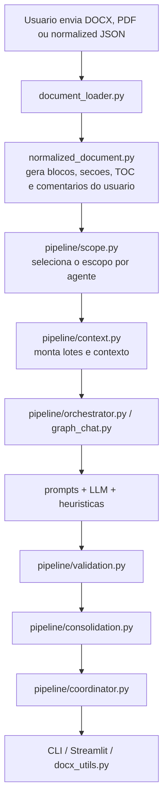
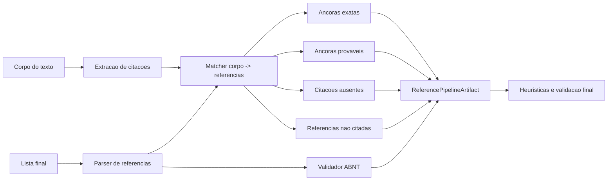

# lang_IPEA_editorial

Sistema de revisao editorial para `.docx`, `.pdf` e `normalized_document.json`, com execucao via CLI e interface web em Streamlit.

O projeto combina:
- extracao estruturada do documento;
- revisao por agentes especializados;
- heuristicas e validacao deterministica;
- consolidacao final dos comentarios;
- exportacao em DOCX comentado e JSON.

## Visao geral

O pipeline atual trabalha em quatro camadas:

1. `document_loader.py` carrega o arquivo de entrada e gera um `NormalizedDocument`.
2. `pipeline/scope.py` define quais trechos cada agente pode revisar.
3. `pipeline/context.py`, `pipeline/runtime.py` e `pipeline/orchestrator.py` executam a revisao lote a lote.
4. `pipeline/validation.py`, `pipeline/consolidation.py` e `pipeline/coordinator.py` limpam a saida e produzem a resposta final.

Os comentarios produzidos pelos agentes passam por filtros de seguranca e deduplicacao antes de aparecer na saida final.

## Agentes

Agentes editoriais atualmente ativos:

- `sinopse_abstract`
- `gramatica_ortografia`
- `tabelas_figuras`
- `estrutura`
- `tipografia`
- `referencias`
- `comentarios_usuario_referencias`

Organizacao do codigo:

- `src/editorial_docx/agents/heuristics/`: heuristicas por agente.
- `src/editorial_docx/agents/scopes/`: regras de escopo.
- `src/editorial_docx/agents/validation/`: regras de validacao.
- `src/editorial_docx/prompts/`: prompts e perfis.

## Comportamento atual importante

### Gramatica e ortografia

O agente de gramatica foi simplificado para operar, por padrao, em modo `TEXTO_INTEIRO`.

Isso significa que:

- o texto inteiro do escopo de gramatica vai em uma unica chamada por passagem;
- nao ha micro-lotes paralelos para esse agente;
- o ponto central dessa configuracao fica em `src/editorial_docx/config.py`, via `GRAMMAR_CONTEXT_MODE`.

Arquivos principais desse fluxo:

- `src/editorial_docx/pipeline/context.py`
- `src/editorial_docx/pipeline/runtime.py`
- `src/editorial_docx/prompts/prompt.py`

### Referencias

O fluxo de referencias agora separa com mais clareza tres responsabilidades:

1. mapear citacoes no corpo do texto;
2. relacionar corpo e lista final de referencias;
3. validar a lista final segundo regras ABNT.

O artefato interno dessa etapa e `ReferencePipelineArtifact`, definido em:

- `src/editorial_docx/models.py`

Ele e construido em:

- `src/editorial_docx/references/analysis.py`

e depois reaproveitado por:

- `src/editorial_docx/agents/heuristics/references.py`
- `src/editorial_docx/pipeline/validation.py`

Hoje esse artefato agrega:

- citacoes do corpo;
- entradas da lista final;
- ancoras exatas;
- ancoras provaveis;
- citacoes sem correspondencia clara;
- referencias nao citadas no corpo;
- problemas ABNT por entrada.

## Estrutura do projeto

### Pastas principais

- `input_data/`
  Arquivos de entrada para revisao.
- `output_data/`
  Artefatos gerados pelo pipeline.
- `docs/`
  Documentacao complementar e notas de estado.
- `testes/`
  Suite de testes automatizados.

### Modulos principais

- `src/editorial_docx/config.py`
  Configuracoes globais do projeto.
- `src/editorial_docx/document_loader.py`
  Carregamento de DOCX, PDF e JSON normalizado.
- `src/editorial_docx/normalized_document.py`
  Modelo intermediario independente da origem do arquivo.
- `src/editorial_docx/graph_chat.py`
  Fachada principal usada pela aplicacao e pelos testes.
- `src/editorial_docx/pipeline/`
  Preparacao de contexto, execucao, validacao, consolidacao e coordenacao final.
- `src/editorial_docx/references/`
  Fachada da camada bibliografica.
- `src/editorial_docx/io/`
  Funcoes de IO e localizacao de comentarios.

### Camada ABNT

O projeto mantem a base bibliografica em dois niveis:

- modulos `abnt_*` em `src/editorial_docx/` com parser, matcher e validator;
- fachada em `src/editorial_docx/references/` para o uso interno do restante do pipeline.

## Fluxo do codigo



## Fluxo de referencias



## Instalacao

Requisitos:

- Python 3.10+
- uma LLM configurada via `.env`

Instalacao basica no ambiente virtual:

```bash
python -m venv .venv
.venv\Scripts\activate
python -m pip install -U pip
python -m pip install -e .[dev]
```

O grupo `dev` instala:

- `pytest`
- `ruff`
- `mypy`

## Execucao

### Streamlit

```bash
streamlit run streamlit_app.py
```

O app:

- lista documentos de `input_data/`;
- permite subir novos arquivos;
- salva artefatos em `output_data/`.

### CLI

```bash
python -m editorial_docx "D:\github\lang_IPEA_editorial\input_data\arquivo.docx"
```

Tambem aceita:

- `.pdf`
- `.json` com `normalized_document`

Argumentos principais:

- `--question`
- `--output-docx`
- `--output-json`
- `--output-normalized-json`

## Saidas

Saidas padrao em `output_data/`:

- `<nome>_normalized_document.json`
- `<nome>_output_<modelo>.relatorio.json`
- `<nome>_output_<modelo>.relatorio.diagnostics.json`
- `<nome>_output_<modelo>.docx`

O pipeline tambem grava snapshots em `output_data/historico/`.

O arquivo `diagnostics.json` resume rastros de execucao por agente e por lote, incluindo:

- falhas de conexao;
- contagem de comentarios do LLM;
- comentarios aceitos por heuristica;
- status de cada lote.

## Configuracao

As constantes centrais ficam em:

- `src/editorial_docx/config.py`

Exemplos de configuracao:

- diretorios de entrada e saida;
- modelo padrao;
- timeout;
- retries;
- limites de batch;
- modo de contexto do agente de gramatica.

As credenciais e provedores sao lidos do `.env`.

### Exemplo OpenAI

```env
LLM_PROVIDER=openai
OPENAI_API_KEY=sk-...
OPENAI_MODEL=gpt-5.2
```

### Exemplo Ollama

```env
LLM_PROVIDER=ollama
OLLAMA_BASE_URL=http://localhost:11434/v1
OLLAMA_MODEL=llama3.1:8b
OLLAMA_API_KEY=ollama
```

### Exemplo OpenAI-compatible

```env
LLM_PROVIDER=openai_compatible
LLM_BASE_URL=http://servidor-interno/v1
LLM_MODEL=nome-do-modelo
LLM_API_KEY=token-opcional
```

## Testes

Rodada principal:

```bash
pytest testes/test_llm.py testes/test_architecture_modular.py testes/test_graph_chat.py -q
```

Rodada focada no pipeline atual de gramatica e referencias:

```bash
pytest testes/test_architecture_modular.py testes/test_graph_chat.py -q
```

Validacao de import e sintaxe:

```bash
python -m compileall src/editorial_docx streamlit_app.py
```

## Observacoes

- `src/editorial_docx/review_heuristics.py` continua existindo como fachada de compatibilidade para imports antigos.
- A interface publica principal do pacote esta em `src/editorial_docx/graph_chat.py`.
- O estado editorial consolidado tambem esta documentado em `docs/ESTADO_ATUAL_EDITORIAL.md`.
