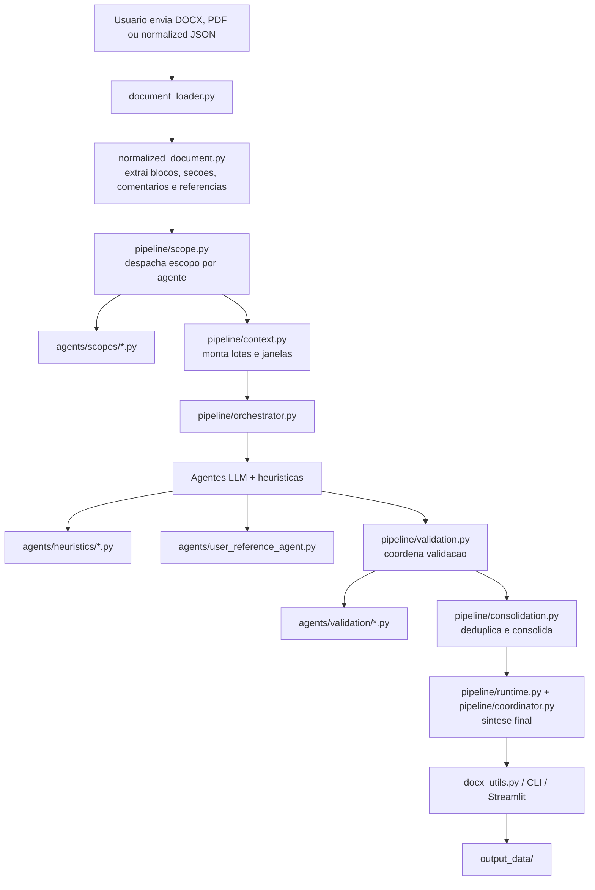
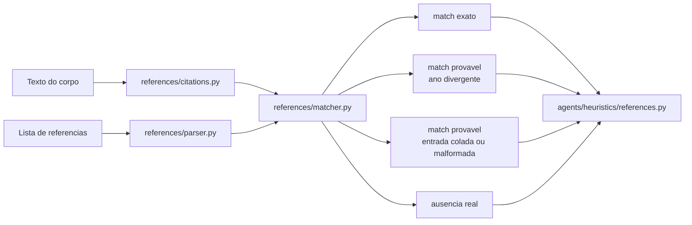

# lang_IPEA_editorial

Sistema de revisao editorial para `.docx`, `.pdf` e `normalized_document.json`, com execucao via CLI e interface web em Streamlit.

O projeto combina:
- extracao estruturada do documento;
- revisao por agentes especializados;
- validacao e consolidacao final;
- exportacao em DOCX comentado e JSON.

## Estrutura Atual

### Pastas de dados

- `input_data/`
  Aqui ficam os arquivos de entrada que o usuario quer revisar.
- `output_data/`
  Aqui ficam os artefatos gerados: DOCX comentado, relatorio JSON, diagnostico e `normalized_document.json`.

### Nucleo da aplicacao

- `src/editorial_docx/config.py`
  Configuracoes compartilhadas do projeto: caminhos, timeout, retries, limites de batch e constantes globais.
- `src/editorial_docx/document_loader.py`
  Carrega DOCX, PDF ou `normalized_document.json`.
- `src/editorial_docx/normalized_document.py`
  Gera e serializa o artefato independente de extracao.
- `src/editorial_docx/pipeline/context.py`
  Prepara lotes, janelas e contexto progressivo.
- `src/editorial_docx/pipeline/scope.py`
  Despacha a selecao de escopo por agente.
- `src/editorial_docx/pipeline/runtime.py`
  Executa chamadas LLM, retries, parsing de saida e coordenador.
- `src/editorial_docx/pipeline/validation.py`
  Coordena a validacao de comentarios por agente.
- `src/editorial_docx/pipeline/consolidation.py`
  Consolida comentarios equivalentes.
- `src/editorial_docx/pipeline/orchestrator.py`
  Orquestra o pipeline de revisao.
- `src/editorial_docx/pipeline/coordinator.py`
  Gera a sintese final do resultado.
- `src/editorial_docx/graph_chat.py`
  Fachada compativel usada pelo restante do projeto e pelos testes.

### Agentes

- `src/editorial_docx/agents/user_reference_agent.py`
  Agente especial para comentarios do usuario pedindo busca de referencia.
- `src/editorial_docx/agents/heuristics/`
  Heuristicas organizadas por agente:
  - `grammar.py`
  - `synopsis.py`
  - `tables_figures.py`
  - `structure.py`
  - `typography.py`
  - `references.py`
  - `dispatch.py`
- `src/editorial_docx/agents/scopes/`
  Regras de escopo por agente:
  - `metadata.py`
  - `synopsis.py`
  - `structure.py`
  - `tables_figures.py`
  - `references.py`
  - `typography.py`
  - `grammar.py`
  - `default.py`
  - `shared.py`
  - `dispatch.py`
- `src/editorial_docx/agents/validation/`
  Regras de validacao por agente:
  - `structure.py`
  - `metadata.py`
  - `tables_figures.py`
  - `typography.py`
  - `references.py`
  - `style_conformity.py`
  - `synopsis.py`
  - `grammar.py`
  - `shared.py`
  - `dispatch.py`

### IO e artefatos

- `src/editorial_docx/io/`
  Fachada para carregamento, serializacao e localizacao de comentarios:
  - `document_loader.py`
  - `normalized_document.py`
  - `docx_utils.py`
  - `comment_localizer.py`

### Regras ABNT e matching bibliografico

- `src/editorial_docx/references/`
  Fachada da camada bibliografica:
  - `normalizer.py`
  - `citations.py`
  - `parser.py`
  - `matcher.py`
  - `rules.py`
  - `validator.py`
  - `document_types.py`

## Fluxo do Codigo



## Fluxo de Referencias



## Execucao

### Streamlit

```bash
streamlit run streamlit_app.py
```

O app:
- le documentos de `input_data/`;
- permite subir novos arquivos direto para `input_data/`;
- salva artefatos em `output_data/`.

### CLI

```bash
python -m editorial_docx "D:\github\lang_IPEA_editorial\input_data\arquivo.docx"
```

Saidas padrao:
- `output_data/<nome>_normalized_document.json`
- `output_data/<nome>_output_<modelo>.relatorio.json`
- `output_data/<nome>_output_<modelo>.relatorio.diagnostics.json`
- `output_data/<nome>_output_<modelo>.docx`

## Configuracao

As constantes centrais estao em:
- `src/editorial_docx/config.py`

Exemplos:
- diretorios de entrada e saida;
- modelo padrao;
- timeout;
- retries;
- tamanho de batch;
- overlap de micro-lotes.

As credenciais e provedores continuam sendo lidos do `.env`.

### Exemplo OpenAI

```env
LLM_PROVIDER=openai
OPENAI_API_KEY=sk-...
OPENAI_MODEL=gpt-5.2
```

### Exemplo Ollama

```env
LLM_PROVIDER=ollama
OLLAMA_BASE_URL=http://localhost:11434/v1
OLLAMA_MODEL=llama3.1:8b
OLLAMA_API_KEY=ollama
```

### Exemplo compativel com OpenAI

```env
LLM_PROVIDER=openai_compatible
LLM_BASE_URL=http://servidor-interno/v1
LLM_MODEL=nome-do-modelo
LLM_API_KEY=token-opcional
```

## Organizacao dos Agentes

Hoje os agentes estao separados por responsabilidade:

- agentes de revisao editorial geral:
  - `sinopse_abstract`
  - `gramatica_ortografia`
  - `tabelas_figuras`
  - `estrutura`
  - `tipografia`
  - `referencias`
- agente especial:
  - `comentarios_usuario_referencias`

O codigo especifico de heuristicas fica em `src/editorial_docx/agents/heuristics/`.
As regras de escopo ficam em `src/editorial_docx/agents/scopes/`.
As regras de validacao ficam em `src/editorial_docx/agents/validation/`.
Os modulos antigos `review_*.py` foram removidos; a estrutura vigente do projeto passa a ser `pipeline/`, `agents/`, `references/` e `io/`.

## Testes

Rodadas principais:

```bash
pytest testes/test_llm.py testes/test_architecture_modular.py testes/test_graph_chat.py -q
```

Validacao de import e sintaxe:

```bash
python -m compileall src/editorial_docx streamlit_app.py
```

## Documentacao Complementar

O estado editorial consolidado continua documentado em:

- `docs/ESTADO_ATUAL_EDITORIAL.md`
