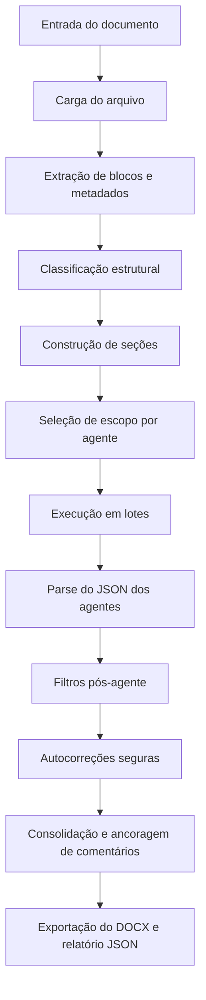

# lang_IPEA_editorial

Sistema de revisão editorial para `.docx` e `.pdf`, com interface em `Streamlit`, orquestração por agentes, autocorreções seguras e exportação de comentários no DOCX.

## Visão Geral

O projeto foi desenhado para:
- receber um documento editorial;
- extrair o conteúdo em blocos estruturais;
- enviar cada trecho só para os agentes compatíveis;
- filtrar falso positivo depois da resposta da LLM;
- aplicar automaticamente só os ajustes formais e seguros;
- exportar um `.docx` comentado e um relatório `.json`.

## Instalação

```bash
python -m pip install -e .
```

## Configuração da LLM

O arquivo principal de configuração é [.env.example](/D:/github/lang_IPEA_editorial/.env.example).

Copie para `.env` na raiz do repositório e ajuste o provider desejado.

### OpenAI

```env
LLM_PROVIDER=openai
OPENAI_API_KEY=sk-...
OPENAI_MODEL=gpt-4o-mini
```

### Ollama

```env
LLM_PROVIDER=ollama
OLLAMA_BASE_URL=http://localhost:11434/v1
OLLAMA_MODEL=llama3.1:8b
OLLAMA_API_KEY=ollama
```

### Endpoint compatível com OpenAI

```env
LLM_PROVIDER=openai_compatible
LLM_BASE_URL=http://servidor-interno/v1
LLM_MODEL=nome-do-modelo
LLM_API_KEY=local
```

## Onde modificar a configuração da LLM

- Arquivo para uso normal: [.env.example](/D:/github/lang_IPEA_editorial/.env.example) e depois `.env` na raiz.
- Lógica de provider/modelo/base URL: [llm.py](/D:/github/lang_IPEA_editorial/src/editorial_docx/llm.py).
- Exibição da configuração na interface: [streamlit_app.py](/D:/github/lang_IPEA_editorial/streamlit_app.py).

Na prática:
- para trocar só provider, modelo e URL, edite `.env`;
- para mudar a lógica de fallback entre `openai`, `ollama` e `openai_compatible`, edite [llm.py](/D:/github/lang_IPEA_editorial/src/editorial_docx/llm.py).

## Execução

Interface:

```bash
streamlit run streamlit_app.py
```

Linha de comando:

```bash
PYTHONPATH=src python -m editorial_docx "testes/arquivo.docx"
```

## Saídas

- `<nome>_output.docx`
- `<nome>_output.relatorio.json`

Para entrada PDF, a saída principal é o relatório JSON com referência de página e bloco.

## Fluxo do Sistema



## Etapas do Fluxo

### 1. Entrada do documento

O sistema aceita:
- `.docx`
- `.pdf`

Entrada via CLI: [__main__.py](/D:/github/lang_IPEA_editorial/src/editorial_docx/__main__.py)  
Entrada via interface: [streamlit_app.py](/D:/github/lang_IPEA_editorial/streamlit_app.py)

### 2. Carga e extração

Em [document_loader.py](/D:/github/lang_IPEA_editorial/src/editorial_docx/document_loader.py), o sistema:
- carrega o arquivo;
- extrai blocos textuais;
- cria referências por bloco;
- monta uma visão inicial das seções.

Para DOCX, a extração fina fica em [docx_utils.py](/D:/github/lang_IPEA_editorial/src/editorial_docx/docx_utils.py).

### 3. Classificação estrutural

Cada bloco recebe um `tipo`, por exemplo:
- `heading`
- `paragraph`
- `caption`
- `table_cell`
- `list_item`
- `reference_entry`
- `reference_heading`
- `direct_quote`

Essa etapa combina:
- quantidade de caracteres;
- estilo do Word;
- presença de numeração;
- posição no documento;
- contexto vizinho;
- heurísticas textuais.

### 4. Construção de seções

Os `headings` reais são usados para:
- delimitar seções;
- melhorar o recorte estrutural;
- evitar que expressões internas do corpo sejam tratadas como título.

### 5. Seleção de escopo por agente

Em [graph_chat.py](/D:/github/lang_IPEA_editorial/src/editorial_docx/graph_chat.py), cada agente recebe só os blocos compatíveis com sua responsabilidade.

Essa etapa é uma das mais importantes do sistema, porque reduz ruído antes mesmo da LLM responder.

### 6. Execução em lotes

Os blocos selecionados são agrupados em lotes que preservam:
- índice global;
- texto;
- tipo estrutural;
- referência do bloco;
- perfil do documento;
- contexto auxiliar de normas e tarefas.

### 7. Parse da resposta

Os agentes respondem em JSON conforme [schemas.py](/D:/github/lang_IPEA_editorial/src/editorial_docx/prompts/schemas.py).

Cada comentário pode conter:
- `category`
- `message`
- `paragraph_index`
- `issue_excerpt`
- `suggested_fix`
- `auto_apply`
- `format_spec`

### 8. Filtros pós-agente

Em [graph_chat.py](/D:/github/lang_IPEA_editorial/src/editorial_docx/graph_chat.py), os comentários passam por validação de escopo e segurança.

Exemplos de bloqueio atual:
- comentário estrutural sobre menção de seção no meio de um parágrafo;
- comentário de título em legenda de tabela ou gráfico;
- comentário de `tabelas_figuras` sobre falta de fonte ancorado em `table_cell`;
- comentário de referência fora de `reference_entry` ou `reference_heading`;
- comentário tipográfico que tenta mexer em conteúdo textual;
- sugestão com `issue_excerpt` idêntico à `suggested_fix`.

### 9. Autocorreções seguras

Só entram em autocorreção quando a mudança é formal, verificável e não muda informação.

Exemplos:
- normalização mecânica de título já existente;
- padronização mecânica de identificador de tabela/figura;
- fonte, tamanho, alinhamento, recuo e espaçamento;
- ajustes mecânicos seguros em referência, sem completar conteúdo ausente.

### 10. Consolidação e ancoragem

Na exportação do DOCX:
- comentários do mesmo parágrafo podem ser consolidados;
- quando os problemas estão em trechos muito diferentes, eles são separados;
- o sistema tenta ancorar no `issue_excerpt`;
- o trecho ancorado recebe destaque amarelo;
- ajustes `auto_apply` ficam silenciosos e não viram comentário visível.

### 11. Exportação

O sistema exporta:
- relatório JSON com comentários visíveis;
- DOCX comentado;
- DOCX já com autoajustes aplicados quando cabível.

## Ordem Atual dos Agentes

A ordem atual está em [prompt.py](/D:/github/lang_IPEA_editorial/src/editorial_docx/prompts/prompt.py):

```python
AGENT_ORDER = [
    "metadados",
    "sinopse_abstract",
    "gramatica_ortografia",
    "tabelas_figuras",
    "referencias",
    "estrutura",
    "tipografia",
]
```

Para mudar a ordem, edite [prompt.py](/D:/github/lang_IPEA_editorial/src/editorial_docx/prompts/prompt.py).

## Responsabilidade de Cada Agente

### `metadados`

Prompt: [metadados.md](/D:/github/lang_IPEA_editorial/src/editorial_docx/prompts/metadados.md)

Vê:
- capa;
- falsa folha;
- blocos editoriais iniciais;
- placeholders explícitos.

Responsabilidade:
- revisar título, autoria, afiliação, dados editoriais e campos preliminares;
- detectar ausência ou duplicidade de metadados visíveis;
- evitar placeholders esquecidos.

Não deve fazer:
- comentar corpo analítico como se fosse metadado;
- atuar em tabela, referência ou citação como se fosse capa.

### `sinopse_abstract`

Prompt: [sinopse_abstract.md](/D:/github/lang_IPEA_editorial/src/editorial_docx/prompts/sinopse_abstract.md)

Vê:
- `SINOPSE`;
- `ABSTRACT`;
- `Palavras-chave`;
- `Keywords`;
- `JEL`.

Responsabilidade:
- revisar forma do resumo;
- cobrar parágrafo único quando aplicável;
- cobrar justificação;
- revisar formatação de palavras-chave e keywords;
- verificar presença e consistência do `JEL` nos blocos PT/EN.

Não deve fazer:
- comentar corpo analítico só porque parece resumo;
- sair dessas seções.

### `gramatica_ortografia`

Prompt: [gramatica_ortografia.md](/D:/github/lang_IPEA_editorial/src/editorial_docx/prompts/gramatica_ortografia.md)

Vê:
- qualquer bloco do documento, desde que haja erro linguístico objetivo.

Responsabilidade:
- revisar ortografia, acentuação, pontuação, concordância, crase e regência;
- agir só quando houver erro linguístico comprovável;
- preservar sentido e tom do texto.

Não deve fazer:
- reescrita estilística disfarçada;
- “trocar seis por meia dúzia”;
- repetir o original como sugestão;
- opinar sobre estrutura ou conteúdo editorial.

### `tabelas_figuras`

Prompt: [tabelas_figuras.md](/D:/github/lang_IPEA_editorial/src/editorial_docx/prompts/tabelas_figuras.md)

Vê:
- `caption`;
- contexto vizinho de tabelas, quadros, gráficos e figuras.

Responsabilidade:
- revisar identificador, subtítulo, fonte, elaboração, unidade e nota;
- verificar posicionamento editorial correto desses componentes;
- permitir autoapply só em normalização mecânica segura do identificador já existente.

Não deve fazer:
- usar `table_cell` para inferir falta de fonte, subtítulo ou identificador;
- inserir `Fonte:` dentro da legenda;
- cobrar fonte/subtítulo fora de `caption`.

### `referencias`

Prompt: [referencias.md](/D:/github/lang_IPEA_editorial/src/editorial_docx/prompts/referencias.md)

Vê:
- `reference_entry`;
- `reference_heading`.

Responsabilidade:
- revisar consistência bibliográfica sustentada por texto visível;
- apontar problemas de pontuação, ordem e composição quando houver base no trecho;
- usar as normas locais do projeto como apoio.

Não deve fazer:
- inventar ano, DOI, paginação, editora, URL ou título faltante;
- tratar caixa alta como erro por padrão;
- atuar fora do bloco de referências.

### `estrutura`

Prompt: [estrutura.md](/D:/github/lang_IPEA_editorial/src/editorial_docx/prompts/estrutura.md)

Vê:
- `heading`;
- títulos reais e blocos estruturalmente inequívocos.

Responsabilidade:
- revisar hierarquia, ordem, duplicidade estrutural, título real e numeração real;
- permitir autoapply só para normalização mecânica de título já existente.

Não deve fazer:
- agir sobre menção de seção dentro de parágrafo;
- transformar expressão interna do corpo em subtítulo;
- tratar `Tabela`, `Figura`, `Gráfico`, `Quadro` ou `Imagem` como seção;
- ancorar sugestão de título fora de `heading` real.

### `tipografia`

Prompt: [tipografia.md](/D:/github/lang_IPEA_editorial/src/editorial_docx/prompts/tipografia.md)

Vê:
- blocos formais compatíveis com autoaplicação segura;
- principalmente `heading`, `caption` e trechos estruturados de abertura.

Responsabilidade:
- revisar fonte, tamanho, negrito, itálico, alinhamento, recuo, espaçamento e entrelinha;
- aplicar automaticamente ajustes formais seguros no DOCX exportado.

Não deve fazer:
- sugerir capitalização editorial;
- alterar conteúdo textual;
- atuar em `reference_entry`;
- aparecer como comentário visível quando for autoaplicado.

### `coordenador`

Prompt: [coordenador.md](/D:/github/lang_IPEA_editorial/src/editorial_docx/prompts/coordenador.md)

Responsabilidade:
- resumir os achados finais;
- apresentar uma visão agregada ao usuário;
- não reexecutar a revisão.

## Fontes Auxiliares

O sistema usa arquivos locais em:
- [auxiliar_utilidades](/D:/github/lang_IPEA_editorial/src/editorial_docx/auxiliar_utilidades)
- [auxiliar_normas](/D:/github/lang_IPEA_editorial/src/editorial_docx/auxiliar_normas)

Esses arquivos alimentam principalmente:
- `tipografia`
- `estrutura`
- `tabelas_figuras`
- `referencias`

## Arquivos Mais Importantes

- [streamlit_app.py](/D:/github/lang_IPEA_editorial/streamlit_app.py): interface, painel de correção e download.
- [graph_chat.py](/D:/github/lang_IPEA_editorial/src/editorial_docx/graph_chat.py): escopo, filtros, batches e coordenação dos agentes.
- [docx_utils.py](/D:/github/lang_IPEA_editorial/src/editorial_docx/docx_utils.py): extração estrutural do DOCX, autoajustes e comentários no Word.
- [document_loader.py](/D:/github/lang_IPEA_editorial/src/editorial_docx/document_loader.py): carga de DOCX/PDF e montagem das seções.
- [llm.py](/D:/github/lang_IPEA_editorial/src/editorial_docx/llm.py): escolha do provider, modelo e base URL.
- [prompt.py](/D:/github/lang_IPEA_editorial/src/editorial_docx/prompts/prompt.py): ordem dos agentes, prompts e contexto auxiliar.
- [test_graph_chat.py](/D:/github/lang_IPEA_editorial/testes/test_graph_chat.py): regressões do pipeline editorial.

## Testes

```bash
pytest -q
```

## Estado Atual

- `tipografia` é silencioso quando autoaplica;
- `estrutura` não roda em modo global;
- `referencias` e `tabelas_figuras` têm filtros fortes de escopo;
- `gramatica_ortografia` está mais amplo, mas filtrado por erro objetivo;
- o sistema suporta `openai`, `ollama` e `openai_compatible` pela mesma fábrica em [llm.py](/D:/github/lang_IPEA_editorial/src/editorial_docx/llm.py).
