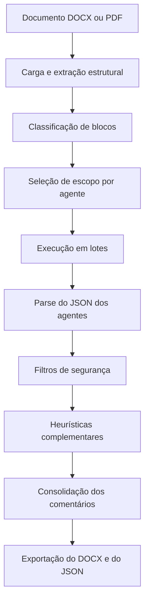

# Estado Atual do Sistema Editorial

Este documento registra o comportamento atual do projeto `lang_IPEA_editorial` após a calibração dos agentes editoriais realizada em março de 2026.

Ele deve ser lido como a referência principal de funcionamento do sistema.

## Objetivo

O projeto revisa arquivos `.docx` e `.pdf` com agentes especializados, produzindo:
- um `.docx` comentado;
- um relatório `.json`;
- comentários editoriais curtos, localizados e acionáveis.

O foco atual do sistema é:
- reduzir falso positivo;
- explicar o problema de forma natural;
- apontar a correção;
- não fazer alterações silenciosas no texto.

## Decisões editoriais consolidadas

As decisões abaixo já estão implementadas no código.

### 1. Não existem correções automáticas silenciosas

Estado atual:
- `0` ajustes automáticos silenciosos na execução padrão;
- todo ajuste aparece como comentário visível no DOCX e no JSON.

Impacto:
- o sistema não altera vírgulas, acentos, títulos, referências ou tipografia sem avisar;
- o relatório JSON e o DOCX representam a revisão efetivamente entregue ao usuário.

Arquivos centrais:
- [__main__.py](D:\github\lang_IPEA_editorial\src\editorial_docx\__main__.py)
- [graph_chat.py](D:\github\lang_IPEA_editorial\src\editorial_docx\graph_chat.py)
- [docx_utils.py](D:\github\lang_IPEA_editorial\src\editorial_docx\docx_utils.py)

### 2. O comentário no Word mostra diagnóstico e correção

Formato atual do balão:
- primeira linha: problema identificado;
- segunda linha: `Correção: ...`

Exemplo:
- `A concordância está incorreta neste fragmento.`
- `Correção: benefícios monetários`

Arquivo central:
- [docx_utils.py](D:\github\lang_IPEA_editorial\src\editorial_docx\docx_utils.py)

### 3. Todos os agentes foram orientados a responder de forma natural

Contrato atual:
- `message` deve dizer o que está errado ou faltando;
- `suggested_fix` deve trazer a correção do fragmento ou uma instrução curta de ajuste;
- mensagens vagas como `ajustar trecho` devem ser evitadas.

Arquivos centrais:
- [prompt.py](D:\github\lang_IPEA_editorial\src\editorial_docx\prompts\prompt.py)
- [schemas.py](D:\github\lang_IPEA_editorial\src\editorial_docx\prompts\schemas.py)

### 4. A revisão de referências segue a ABNT e não inventa dados

Base normativa principal:
- [ABNT NBR 6023 (21-05-2025) (1).pdf](D:\github\lang_IPEA_editorial\src\editorial_docx\auxiliar_utilidades\ABNT%20NBR%206023%20(21-05-2025)%20(1).pdf)
- [ABNT NBR 10520 (19-07-2023) (1).pdf](D:\github\lang_IPEA_editorial\src\editorial_docx\auxiliar_utilidades\ABNT%20NBR%2010520%20(19-07-2023)%20(1).pdf)

Comportamento atual do agente `ref`:
- aponta erro local visível;
- informa o que está faltando quando isso é objetivamente verificável;
- não usa conhecimento externo para completar referência;
- não reescreve a referência inteira por erro pequeno;
- não sugere itálico em título de artigo.

Exemplos esperados:
- referência incompleta;
- duplicação de `local: editora`;
- falta de `Acesso em:` em referência online;
- referências coladas;
- erro local de pontuação ou paginação.

Arquivo central:
- [referencias.md](D:\github\lang_IPEA_editorial\src\editorial_docx\prompts\referencias.md)

### 5. O agente de estrutura continua disponível, mas saiu da execução padrão

Comportamento atual:
- ignora pré-textuais como `SINOPSE`, `ABSTRACT`, `Keywords`, `JEL`;
- começa a leitura estrutural a partir de `Introdução` ou variantes;
- cobra consistência entre títulos de mesmo nível;
- pode numerar `Introdução`, seções intermediárias, `Considerações finais` e `Referências` quando o documento mistura títulos numerados e não numerados;
- não usa comentário narrativo com `parágrafo X`.

Uso atual:
- o agente continua implementado e testado;
- ele não entra mais na execução padrão do projeto;
- pode ser acionado de forma dirigida quando houver interesse específico em revisão estrutural.

Arquivo central:
- [estrutura.md](D:\github\lang_IPEA_editorial\src\editorial_docx\prompts\estrutura.md)

### 6. O agente de tipografia foi separado de gramática e pontuação

Comportamento atual:
- `tip` olha para tamanho, caixa, negrito, itálico, alinhamento, recuo, espaçamento e entrelinha;
- `tip` não trata família de fonte como problema editorial autônomo;
- ortografia e pontuação pertencem ao agente `gram`.

Arquivo central:
- [tipografia.md](D:\github\lang_IPEA_editorial\src\editorial_docx\prompts\tipografia.md)

### 7. O agente de tabelas e figuras voltou a atuar

Comportamento atual:
- segue ativo no fluxo padrão;
- comenta principalmente:
  - necessidade de separar o identificador na primeira linha e o título descritivo na linha abaixo;
  - ausência de linha própria de `Fonte:` ou `Elaboração:` abaixo do bloco, quando isso é objetivamente visível;
- continua bloqueando falso positivo em célula interna de tabela;
- continua bloqueando falsa cobrança de identificador quando a legenda já começa com `Tabela`, `Figura`, `Quadro` ou `Gráfico`.

Arquivo central:
- [tabelas_figuras.md](D:\github\lang_IPEA_editorial\src\editorial_docx\prompts\tabelas_figuras.md)

## Fluxo atual do sistema



## Saídas

### DOCX

O DOCX exportado:
- ancora o comentário no trecho ou parágrafo pertinente;
- mostra o autor do comentário como `Revisão: <sigla do agente>`;
- usa balão com:
  - uma linha de diagnóstico;
  - uma linha com `Correção: ...`

### JSON

O relatório `.json` exporta:
- `agent`
- `category`
- `message`
- `paragraph_index`
- `issue_excerpt`
- `suggested_fix`

Não há mais seção separada de correções silenciosas.

## Agentes ativos na execução padrão

A ordem padrão atual é:

```python
AGENT_ORDER = [
    "sinopse_abstract",
    "gramatica_ortografia",
    "tabelas_figuras",
    "referencias",
    "tipografia",
]
```

Arquivo central:
- [prompt.py](D:\github\lang_IPEA_editorial\src\editorial_docx\prompts\prompt.py)

### Siglas curtas nas saídas

Mapeamento atual:
- `sinopse_abstract` -> `sin`
- `estrutura` -> `est`
- `gramatica_ortografia` -> `gram`
- `tabelas_figuras` -> `tab`
- `referencias` -> `ref`
- `tipografia` -> `tip`
- `metadados` -> `meta`
- `coordenador` -> `coord`

Arquivo central:
- [models.py](D:\github\lang_IPEA_editorial\src\editorial_docx\models.py)

## Responsabilidade atual de cada agente

### `sin`

Escopo:
- `SINOPSE`
- `ABSTRACT`
- `Palavras-chave`
- `Keywords`
- `JEL`

Foco:
- repetição evidente;
- alinhamento objetivo entre listas de palavras-chave;
- inconsistência textual clara.

Não deve:
- inferir formatação sem evidência;
- inventar desalinhamento semântico;
- comentar corpo do texto como se fosse resumo.

### `est`

Escopo:
- títulos e blocos estruturalmente inequívocos.

Foco:
- consistência de numeração;
- hierarquia real;
- títulos finais recorrentes;
- paralelismo formal de seções equivalentes.

Não deve:
- usar menção de seção dentro do corpo como evidência;
- tratar legenda de figura/tabela como seção;
- comentar com referência a número de parágrafo.

Status:
- disponível no projeto;
- fora da execução padrão.

### `gram`

Escopo:
- qualquer trecho com erro linguístico objetivo.

Foco:
- ortografia;
- concordância;
- regência;
- crase;
- pontuação local obrigatória.

Não deve:
- reescrever por estilo;
- mexer em citação direta;
- propor correção que dependa de reinterpretar toda a frase.

Observação importante:
- é o agente mais sujeito a oscilação entre execuções, por depender mais da LLM.

### `tab`

Escopo:
- `caption`
- vizinhança imediata de bloco de tabela, quadro, figura ou gráfico

Foco:
- separação entre identificador e subtítulo;
- presença de linha própria de fonte ou elaboração;
- legibilidade local em bloco editorial.

Não deve:
- inferir ausência de fonte a partir de célula interna;
- inserir `Fonte:` dentro da legenda;
- cobrar identificador quando a legenda já o traz.

### `ref`

Escopo:
- `reference_entry`
- `reference_heading`

Foco:
- composição local da referência;
- ano inconsistente dentro do próprio trecho;
- paginação;
- `In:`
- `Disponível em:` e `Acesso em:`
- duplicação de local/editora;
- referência colada.

Não deve:
- inventar dado ausente;
- usar memória externa;
- corrigir grafismo de artigo com itálico indevido.

### `tip`

Escopo:
- títulos;
- subtítulos;
- legendas;
- blocos com padrão tipográfico comparável.

Foco:
- caixa;
- negrito;
- itálico;
- tamanho;
- alinhamento;
- recuo;
- espaçamento.

Não deve:
- discutir ortografia ou pontuação;
- agir sobre conteúdo;
- usar família de fonte como erro editorial autônomo.

## Arquivos mais importantes para manutenção

### Orquestração
- [graph_chat.py](D:\github\lang_IPEA_editorial\src\editorial_docx\graph_chat.py)

### Extração e exportação DOCX
- [docx_utils.py](D:\github\lang_IPEA_editorial\src\editorial_docx\docx_utils.py)

### Carga de documento
- [document_loader.py](D:\github\lang_IPEA_editorial\src\editorial_docx\document_loader.py)

### Prompt base e contrato de saída
- [prompt.py](D:\github\lang_IPEA_editorial\src\editorial_docx\prompts\prompt.py)
- [schemas.py](D:\github\lang_IPEA_editorial\src\editorial_docx\prompts\schemas.py)

### Prompts por agente
- [sinopse_abstract.md](D:\github\lang_IPEA_editorial\src\editorial_docx\prompts\sinopse_abstract.md)
- [estrutura.md](D:\github\lang_IPEA_editorial\src\editorial_docx\prompts\estrutura.md)
- [gramatica_ortografia.md](D:\github\lang_IPEA_editorial\src\editorial_docx\prompts\gramatica_ortografia.md)
- [tabelas_figuras.md](D:\github\lang_IPEA_editorial\src\editorial_docx\prompts\tabelas_figuras.md)
- [referencias.md](D:\github\lang_IPEA_editorial\src\editorial_docx\prompts\referencias.md)
- [tipografia.md](D:\github\lang_IPEA_editorial\src\editorial_docx\prompts\tipografia.md)

### Testes de regressão
- [test_graph_chat.py](D:\github\lang_IPEA_editorial\testes\test_graph_chat.py)
- [test_llm.py](D:\github\lang_IPEA_editorial\testes\test_llm.py)

## Normas e arquivos auxiliares usados como referência

- [231219_tutorial_da_publicacao_expressa (1).pdf](D:\github\lang_IPEA_editorial\src\editorial_docx\auxiliar_utilidades\231219_tutorial_da_publicacao_expressa%20(1).pdf)
- [ABNT NBR 6023 (21-05-2025) (1).pdf](D:\github\lang_IPEA_editorial\src\editorial_docx\auxiliar_utilidades\ABNT%20NBR%206023%20(21-05-2025)%20(1).pdf)
- [ABNT NBR 10520 (19-07-2023) (1).pdf](D:\github\lang_IPEA_editorial\src\editorial_docx\auxiliar_utilidades\ABNT%20NBR%2010520%20(19-07-2023)%20(1).pdf)
- [Agente IA Editorial (tarefas) (1).docx](D:\github\lang_IPEA_editorial\src\editorial_docx\auxiliar_utilidades\Agente%20IA%20Editorial%20(tarefas)%20(1).docx)
- [custom_2026_associacao-brasileira-de-normas-tecnicas-ipea.csl](D:\github\lang_IPEA_editorial\src\editorial_docx\auxiliar_utilidades\custom_2026_associacao-brasileira-de-normas-tecnicas-ipea.csl)

## Execução

### CLI

```bash
python -m src.editorial_docx "D:\github\lang_IPEA_editorial\testes\arquivo.docx"
```

### Streamlit

```bash
streamlit run streamlit_app.py
```

## Estado de testes no momento desta documentação

Última validação local:
- `pytest testes\test_graph_chat.py -q`
- `pytest testes\test_llm.py -q`

Resultado esperado:
- suíte verde

## Limitações conhecidas

### 1. A saída da LLM pode variar entre execuções

Mesmo com prompts e filtros estabilizados:
- `gram` e `sin` ainda podem variar mais;
- `tab`, `est` e parte de `ref` tendem a ficar mais estáveis por causa das heurísticas locais.

### 2. O projeto continua dependente da qualidade da extração estrutural

Se o DOCX vier muito desformatado:
- a classificação de blocos pode perder contexto;
- alguns agentes podem ficar excessivamente conservadores;
- a revisão estrutural pode exigir heurísticas adicionais.

### 3. O sistema foi calibrado com base em critérios editoriais do Ipea

Isso significa que:
- o comportamento atual está intencionalmente mais rígido em estrutura, referências e blocos editoriais;
- nem toda escolha coincide com uma revisão genérica de mercado.

## Como evoluir a partir daqui

Se for preciso ajustar o sistema depois desta versão:

### Para mudar o tom dos comentários
- editar [prompt.py](D:\github\lang_IPEA_editorial\src\editorial_docx\prompts\prompt.py)
- editar [schemas.py](D:\github\lang_IPEA_editorial\src\editorial_docx\prompts\schemas.py)

### Para mudar o comportamento de um agente específico
- editar o prompt correspondente em `src/editorial_docx/prompts`
- revisar os filtros e heurísticas em [graph_chat.py](D:\github\lang_IPEA_editorial\src\editorial_docx\graph_chat.py)

### Para mudar a forma do comentário no Word
- editar [docx_utils.py](D:\github\lang_IPEA_editorial\src\editorial_docx\docx_utils.py)

### Para preservar comportamento estável
- adicionar teste em [test_graph_chat.py](D:\github\lang_IPEA_editorial\testes\test_graph_chat.py) antes de alterar a lógica
